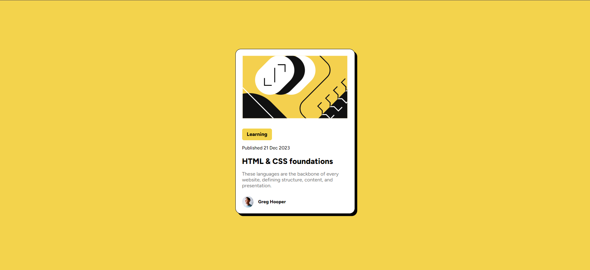

# Frontend Mentor - Blog card preview solution

This is a solution to the [Blog card preview challenge on Frontend Mentor](https://www.frontendmentor.io/challenges/blog-preview-card-ckPaj01IcS). Frontend Mentor challenges help you improve your coding skills by building realistic projects. 

## Table of contents

- [Overview](#overview)
  - [Screenshot](#screenshot)
- [My process](#my-process)
  - [Built with](#built-with)
  - [Continued development](#continued-development)
  - [Useful resources](#useful-resources)

## Overview

This is a challenge where I have to design a blog card preview. It's been done using HTML & CSS.

### Screenshot

 

## My process 

I tried to notice every little detail in the given design and made some notes like font family, size, etc. I went step by step, beginning with making divs. After creating a basic layout of all parts, I focused on making it similar to the design. As I fixed the size of the div, I moved to the image and then the text. At last, I moved the div to the middle and added the minor details.

### Built with

- Semantic HTML5 markup
- CSS custom properties
- Flexbox
- Google fonts

### Continued development

Rounding the corners of the SVG file was a new challenge to me. However, I failed to overcome it but I definitely got better with CSS.

### Useful resources

- [Stack Overflow](https://www.stackoverflow.com) - This helped me for various little problems. I really liked this pattern and will use it going forward. It had the best possible answers to my questions.